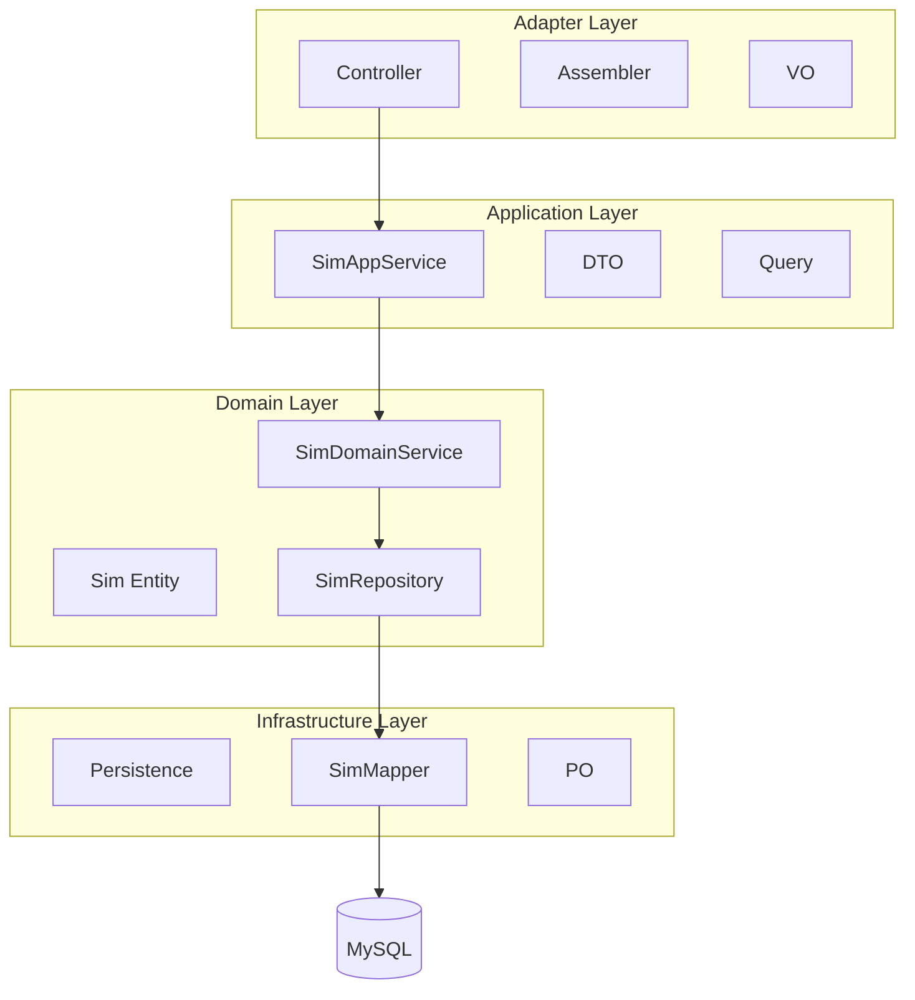
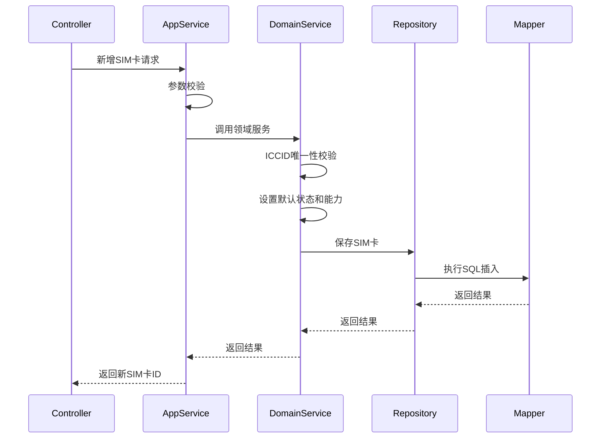
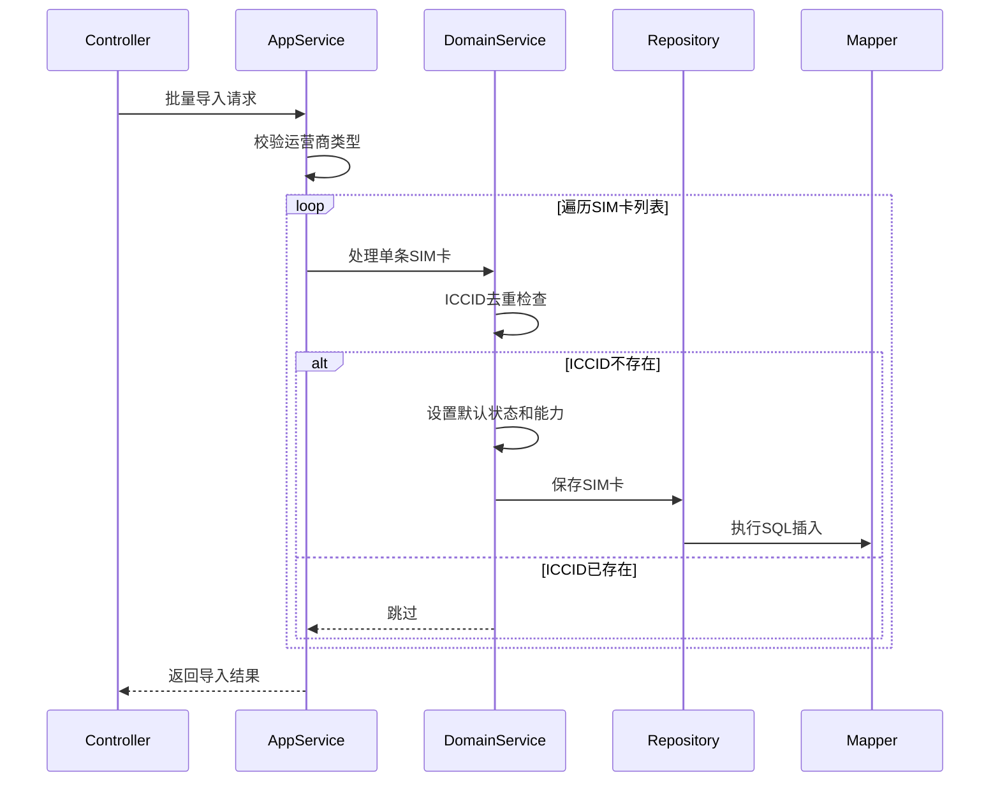
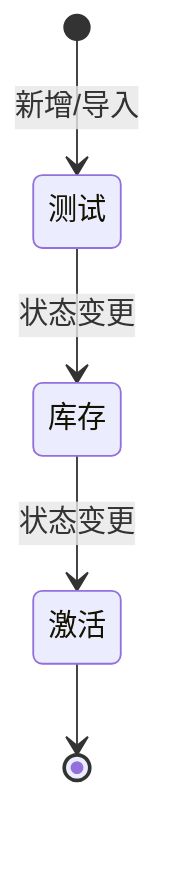

# CCS系统SIM卡模块 - Design

## 1. Architecture Overview



CCS系统SIM卡模块采用DDD分层架构，分为Adapter、Application、Domain、Infrastructure四层。各层职责清晰，依赖关系单向，确保系统的可维护性和可扩展性。

## 2. Tech Stack & Decisions

| Decision | Choice | Alternatives | Rationale |
|----------|--------|--------------|-----------|
| 后端框架 | Spring Boot 3.x | Spring Boot 2.x, Quarkus | 与现有技术栈一致，社区活跃 |
| ORM框架 | MyBatis | JPA, MyBatis-Plus | 团队熟悉度高，SQL可控性强 |
| 数据库 | MySQL 8.0 | PostgreSQL, Oracle | 成本低，性能满足需求 |
| 服务调用 | OpenFeign | RestTemplate, WebClient | 声明式API，简化微服务调用 |
| 权限控制 | Spring Security | Shiro, Sa-Token | 成熟稳定，功能完善 |
| Excel处理 | Apache POI | EasyExcel, JXL | 功能全面，社区支持好 |

## 3. Data Model

### 3.1 SIM卡主表（tb_sim）

| 字段名 | 类型 | 必填 | 默认值 | 说明 |
|--------|------|------|--------|------|
| id | BIGINT | 是 | 自增 | 主键 |
| iccid | VARCHAR(50) | 是 | - | 集成电路卡识别码 |
| imsi | VARCHAR(50) | 否 | NULL | 国际移动用户识别号 |
| msisdn | VARCHAR(20) | 是 | - | 手机号 |
| mno_code | VARCHAR(50) | 是 | - | 运营商编码 |
| sim_state | SMALLINT | 是 | 1 | SIM卡状态：1-测试，2-库存，3-激活 |
| sms_ability | TINYINT | 否 | 0 | 短信能力 |
| data_ability | TINYINT | 否 | 0 | 数据能力 |
| voice_ability | TINYINT | 否 | 0 | 语音能力 |
| description | VARCHAR(255) | 否 | NULL | 备注 |
| create_time | TIMESTAMP | 是 | CURRENT_TIMESTAMP | 创建时间 |
| create_by | VARCHAR(64) | 否 | NULL | 创建者 |
| modify_time | TIMESTAMP | 是 | CURRENT_TIMESTAMP | 修改时间 |
| modify_by | VARCHAR(64) | 否 | NULL | 修改者 |
| row_version | INT | 否 | 1 | 记录版本 |
| row_valid | TINYINT | 否 | 1 | 记录是否有效 |

**索引：**
- PRIMARY KEY (id)
- UNIQUE KEY (iccid)

### 3.2 SIM卡变更日志表（tb_sim_log）

| 字段名 | 类型 | 必填 | 默认值 | 说明 |
|--------|------|------|--------|------|
| id | BIGINT | 是 | 自增 | 主键 |
| iccid | VARCHAR(50) | 是 | - | 集成电路卡识别码 |
| sim_state | SMALLINT | 是 | - | SIM卡状态：1-测试，2-库存，3-激活 |
| sms_ability | TINYINT | 否 | 0 | 短信能力 |
| data_ability | TINYINT | 否 | 0 | 数据能力 |
| voice_ability | TINYINT | 否 | 0 | 语音能力 |
| description | VARCHAR(255) | 否 | NULL | 备注 |
| create_time | TIMESTAMP | 是 | CURRENT_TIMESTAMP | 创建时间 |
| create_by | VARCHAR(64) | 否 | NULL | 创建者 |
| modify_time | TIMESTAMP | 是 | CURRENT_TIMESTAMP | 修改时间 |
| modify_by | VARCHAR(64) | 否 | NULL | 修改者 |
| row_version | INT | 否 | 1 | 记录版本 |
| row_valid | TINYINT | 否 | 1 | 记录是否有效 |

**索引：**
- PRIMARY KEY (id)
- INDEX idx_iccid (iccid)

## 4. Core Flows

### 4.1 SIM卡新增流程



### 4.2 批量导入流程



### 4.3 状态流转流程



## 5. API Contracts

### 5.1 管理后台接口

**基础路径：** `/api/mpt/sim/v1`

#### 5.1.1 分页查询SIM卡列表
- **请求方式：** GET
- **路径：** `/list`
- **权限：** `iov:mno:sim:list`
- **请求参数：**
  - iccid：ICCID（可选）
  - beginTime：开始时间（可选）
  - endTime：结束时间（可选）
  - pageNum：页码（默认1）
  - pageSize：每页数量（默认10）
- **响应结果：**
  ```json
  {
    "code": 200,
    "msg": "success",
    "data": {
      "total": 100,
      "list": [
        {
          "id": 1,
          "iccid": "8986012345678901234",
          "imsi": "460012345678901",
          "msisdn": "13800138000",
          "mnoCode": "CMCC",
          "simState": 3,
          "smsAbility": true,
          "dataAbility": true,
          "voiceAbility": true,
          "description": "测试SIM卡",
          "createTime": "2024-01-01 00:00:00",
          "createBy": "admin"
        }
      ]
    }
  }
  ```

#### 5.1.2 获取SIM卡详情
- **请求方式：** GET
- **路径：** `/{simId}`
- **权限：** `iov:mno:sim:query`
- **路径参数：**
  - simId：SIM卡ID
- **响应结果：** 同单条SIM卡对象

#### 5.1.3 新增SIM卡
- **请求方式：** POST
- **路径：** `/`
- **权限：** `iov:mno:sim:add`
- **请求体：**
  ```json
  {
    "iccid": "8986012345678901234",
    "imsi": "460012345678901",
    "msisdn": "13800138000",
    "mnoCode": "CMCC",
    "description": "测试SIM卡"
  }
  ```
- **响应结果：**
  ```json
  {
    "code": 200,
    "msg": "success",
    "data": 1
  }
  ```

#### 5.1.4 修改SIM卡
- **请求方式：** PUT
- **路径：** `/`
- **权限：** `iov:mno:sim:edit`
- **请求体：**
  ```json
  {
    "id": 1,
    "iccid": "8986012345678901234",
    "imsi": "460012345678901",
    "msisdn": "13800138000",
    "mnoCode": "CMCC",
    "description": "更新SIM卡"
  }
  ```
- **响应结果：** 同新增接口

#### 5.1.5 删除SIM卡
- **请求方式：** DELETE
- **路径：** `/{simIds}`
- **权限：** `iov:mno:sim:remove`
- **路径参数：**
  - simIds：SIM卡ID数组，逗号分隔
- **响应结果：** 同新增接口

#### 5.1.6 导出SIM卡信息
- **请求方式：** POST
- **路径：** `/export`
- **权限：** `iov:mno:sim:export`
- **请求参数：** 同查询参数
- **响应结果：** Excel文件流

### 5.2 服务接口

**基础路径：** `/api/service/sim/v1`

#### 5.2.1 批量导入SIM卡
- **请求方式：** POST
- **路径：** `/batchImport`
- **请求体：**
  ```json
  {
    "mnoType": "CMCC",
    "simList": [
      {
        "iccid": "8986012345678901234",
        "imsi": "460012345678901",
        "msisdn": "13800138000"
      }
    ],
    "batchNum": "BATCH20240101001"
  }
  ```
- **响应结果：** 无返回值

## 6. Coverage Mapping

| US-ID | Design Section | Note |
|-------|----------------|------|
| US-001 | §5.1.1, §5.1.2, §5.1.6 | 查询功能对应分页查询、详情、导出接口 |
| US-002 | §4.1, §5.1.3 | 新增流程和新增接口 |
| US-003 | §5.1.4 | 修改接口 |
| US-004 | §5.1.5 | 删除接口 |
| US-005 | §4.3 | 状态流转设计 |
| US-006 | §3.1 (ability字段) | 能力字段设计 |
| US-007 | §4.2, §5.2.1 | 批量导入流程和接口 |

## 7. Impact Analysis

### 7.1 影响范围
- **数据库**：新增tb_sim和tb_sim_log两张表
- **API网关**：需注册新的路由规则
- **权限系统**：需配置新的权限点
- **前端**：需开发SIM卡管理页面

### 7.2 风险点
- ICCID唯一性约束可能导致导入失败
- 批量导入性能需优化
- 状态流转需严格校验

## 8. Open Questions

- [ ] 是否需要支持SIM卡批量删除的事务回滚？
- [ ] 导入失败时是否需要返回详细的失败原因？
- [ ] 是否需要支持SIM卡状态的反向流转？

## 9. Changelog

| Date | Change ID | Type | Description |
|------|-----------|------|-------------|
| 2024-01-01 | CR-001 | Added | 初始设计文档创建 |
